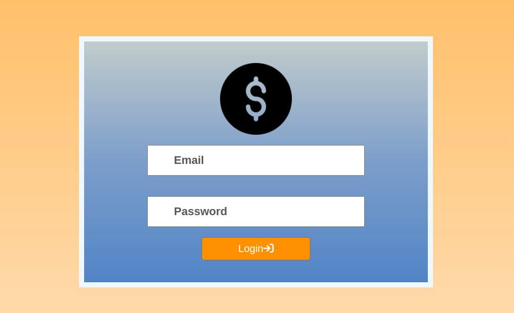
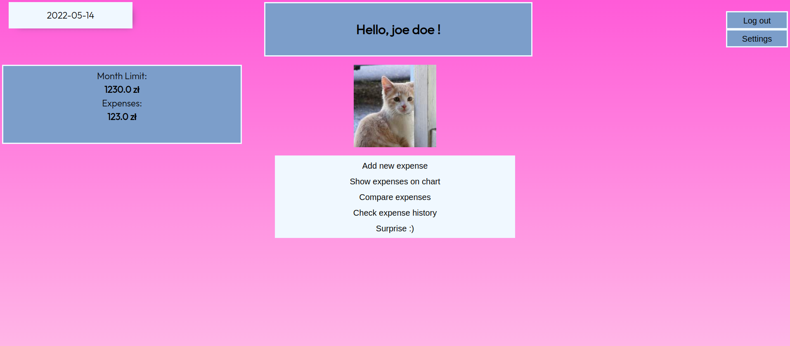
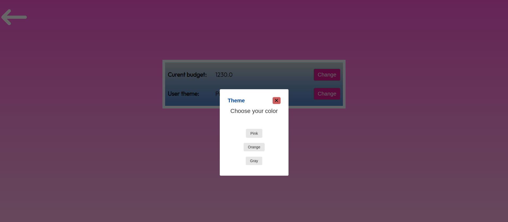
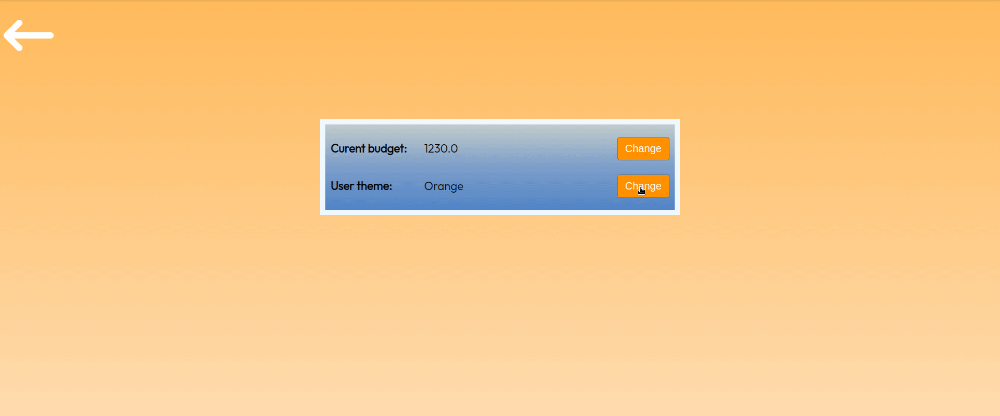
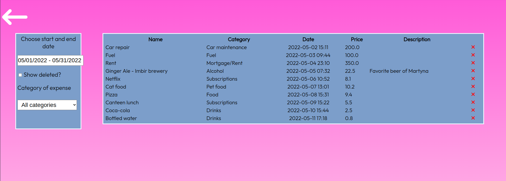
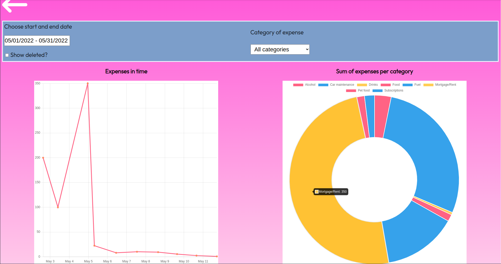
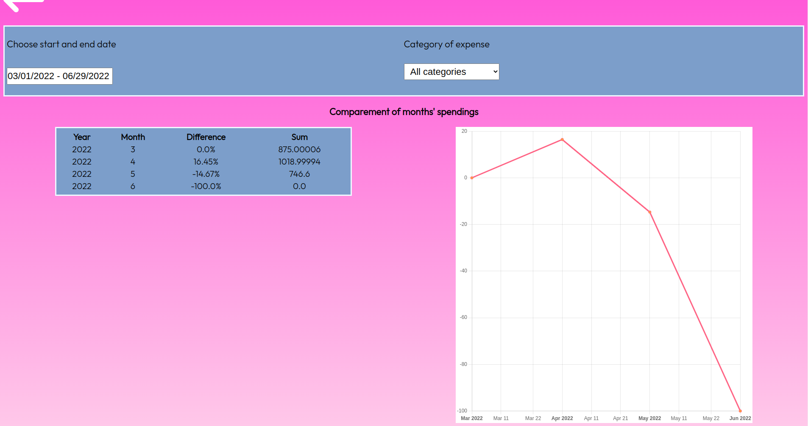

# Wizja

Created: March 26, 2022 11:47 AM

## **Tytuł projektu**

1. Spending App

## **Realizowany przez**

1. Jakub Stępień
2. Łukasz Pawlak
3. Martyna Olszewska

## **Cel projektu**

1. Aplikacja pozwalająca rejestrować wydatki oraz pokazująca jak zmieniają się nasze wydatki w miesiącach. Pozwala zauważyć zwiększające się ceny w przyjemny sposób.

## **User Stories**

1. **Logowanie**
    1. Użytkownik loguje się podając email oraz hasło ze strony logowania.
2. **Dodanie wydatku**
    1. Użytkownik dodaje wydatek, wypełniając odpowiednie pola.
3. **Ustalenie miesięcznego dochodu/budżetu**
    1. Użytkownik ustala ile ma dochodu/budżetu.
4. **Porównanie z poprzednimi miesiącami**
    1. Użytkownik wybiera zakres dat i w tym przedziale czasowym pokazuje mu się wykres liniowy z podziałem na miesiące.
5. **Historia wydatków**
    1. Użytkownik zaznacza zakres dat oraz wybiera kategorie i jest wyświetlana dla niego historia wydatków (pogrupowana po zaznaczonych opcjach) w formie wykresu kołowego lub listy.
6. **Kolory interface'u**
    1. Aplikacja umożliwia wybranie koloru interface'u użytkownikowi.

## **Technologie**

1. Scala 2
2. Framework Scala Play
3. PostgreSQL
4. Docker

## **Result**

Można się zalogować

Zobaczyć stronę główną z najważniejszymi informacjami

Wybrać kolor :)

Zobaczyć historię wydatków i ją przefiltrować bez submita 8) (ajax robi brrr)

Jak ktoś nie lubi tabelek to są też wykresy

I nawet można zobaczyć modsumowanie miesięczne wraz z wykresem pokazującym różnicę procentową między wydatkami z danego pierwszego wybranego miesiąca 8)

