### FRM

W Scali 2 podczas korzystania z biblioteki Slick nie używamy klasycznego ORM'a, lecz FRM'a który dzięki metodzie `(un)apply` umozliwia zmienić krotki na obiekty.

TODO: Może warto coś jeszcze dopisać o FRM? Dla mnie jeszcze nie jest takie oczywiste czym się różni jedno od drugiego.

Większą zmianą przychodząc np z Hibernate jest to, że nie mamy mutowalności obiektów i persystencja obiektów nie jest zachowana automatycznie. Bazujemy bardziej na tym aby szybko wyciągnąć dane oraz coś z nimi zrobić, a nie zachować persystencje przez sesję.

Poprzez uproszczenie tych zapytań i persystencji Slick osiągnął mniejsze pliki konfiguracyjne które w naszym przypadku zajmują około 5 linii.

Aby stworzyć zapytania do bazy i posiadać sprawdzanie typów argumentów w trakcie kompilacji możemy zmapować tabelę z bazy:

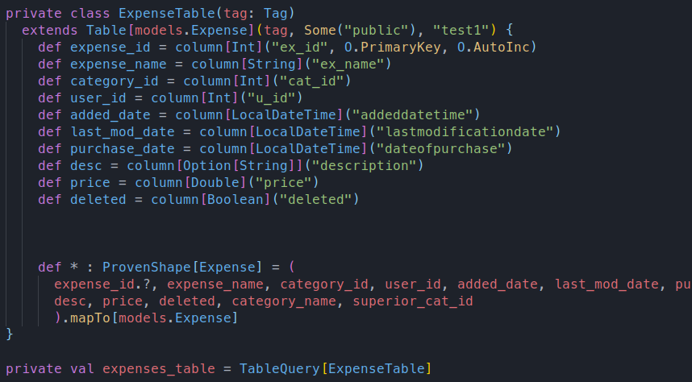

Dzięki temu możemy skonstruować między innymi takie zapytanie:

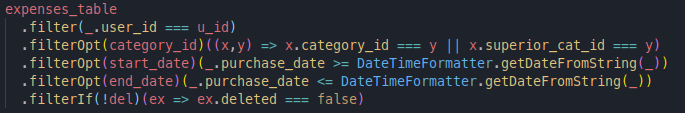

TODO: Podpisanie powyższego query krótko jednym zdaniem co robi.

Argumenty po prawej stronie w nawiasach mogą być sprawdzane statycznie więc podczas kompilacji można otrzymać stosowną informację.

Takie zapytanie jest możliwe do ponownego wykorzystania bez dodatkowego nakładu zapytań na bazę danych. Przykładem na to jest wykres kołowy obrazujący podział wydatków względem poszczególnych kategorii gdzie użyliśmy poniższego zapytania:

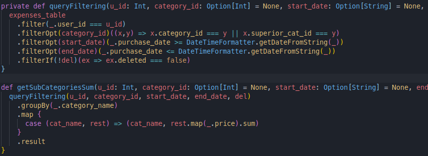

Ze względu na ograniczenia narzucone przez JDBC musieliśmy zrealizować oprawę procedur pobierających `ResultSet` przy użyciu czystego SQL.
Przykładem może być ten krótki kod:

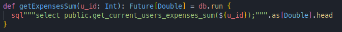

Oznaczenie `sql` przed `"""` informuje kompilator o tym, że w tym Stringu znajduje się plain SQL, który zostaje zmieniony na `PreparedStatement`, argument do procedury (u_id) w takim zapisie wygląda jak wpisany jako konkatenacja pozwalając na SQLInjection, lecz wywołując query możemy zobaczyć następujący kod wynikowy sql:

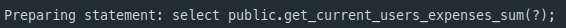

Zatem możemy bez większego strachu pisać własne zapytania/procedury wiedząc że np stringi dodane do zapytania będą wolne od tej podatności.

Większym problemem, który napotkaliśmy podczas pracy z tą biblioteką jest tworzenie zapytań do większej ilości tabel niż 1.
Joiny w Slicku są zrobione bardzo słabo i dopóki trzymamy wszystkie mapowania tabel w jednej klasie to możliwe jest połączenie wyników, lecz gdy chcemy oddzielić tabele na osobne pliki to nie możemy dostać się do TableQuery, które odpowiada za tworzenie zapytań.
Nawet gdy zmienimy dostęp na `public` to podczas kompilacji dowiemy się że ExecutionPool jest innym obiektem/instancją i nie możemy tego mieszać i stworzyć takiego zapytania.
Naszym rozwiązaniem na ten problem było stworzenie widoku, który zawierał (niestety) subquery w 2 miejscach, aby umożliwić korzystanie z niego jak z tabeli.

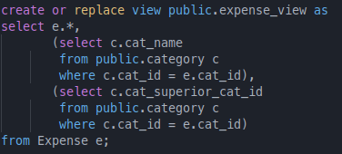

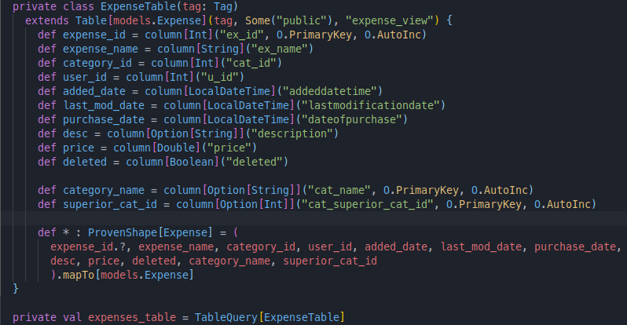

Umożliwiło to uniknięcie niepotrzebnego zamieszania podczas dodania nowego wydatku do bazy poprzez prosty interface Slicka:

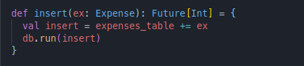

Kolejnym problemem, którego nie udało nam się rozwiązać po stronie Scali jest utrzymywanie danych pieniężnych po stronie serwera bazodanowego w formie `Money`. O ile PostgreSQL z którego korzystaliśmy posiada taką implementację, a także w implementacji JDBC dla Postgresa jest typ PGMoney (w Javie) to w momencie, gdy chcieliśmy użyć go w Slicku okazało się, że nie ma on zaimplementowanego mapowania z serwera do aplikacji.
Uniemożliwiło to nam utrzymanie takiego typu i musieliśmy zmienić na typ `real`, który mapujemy na `Double`.

Takie zapytanie wykonywane jest asynchronicznie przy pomocy `Future` dostępnego w Scali.  Domyślnie w Slicku tworzonych jest 20 wątków odpowiedzialnych za połączenie z bazą.  Future który zwrócimy korzysta z tych wątków co powoduje że nie musimy się przejmować gdzie i jak zostanie wykonane.
Oczywiście w świecie idealnym nie musimy się o to martwić, jednak jako że Slick jest na JDBC a ten znowu na Javie to rzucanie wyjątkami wszędzie gdzie się da jest normą. Podczas pisania aplikacji przyjęliśmy optymistyczną wizję co do dostępności bazy.

Jednak gdyby zastanowić się nad połączeniami i jak dokładnie są obserwowane to niestety brak możliwości obserwowania jest dużym minusem Slick'a.

Podczas przemyśleń dotyczących architektury projektu jednym z pomysłów było zastosowanie się do `Reactive Manifesto` i użycie aktorów z biblioteki Akka.
Future nie jest jednak w żadnym stopniu odpowiednim narzędziem przystosowanym do aktorów, gdyż nie jesteśmy w stanie określić na jakim wątku jest wykonywana operacja blokująca.

W samym Akka istnieją strumienie zatem wydawało się że idealnie nadadzą się do odczytywania danych z bazy. Jednak to wymagało by własnej implementacji połączenia z bazą danych co jest przytłaczające.

Jednak mimo, że jest to bardzo zła implementacja i w środowisku produkcyjnym nie zdecydowalibyśmy się na taki krok to użyliśmy jednego aktora, aby poznać choć minimum pracy z Akką. Jest to aktor odpowiedzialny za autoryzację użytkownika.

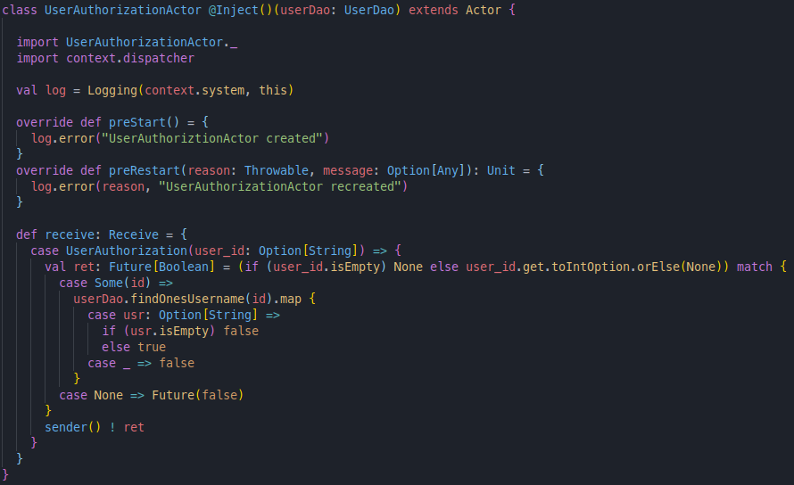

Powyższy screen przedstawia prostego aktora z jedną metodą, którą wykorzystywaliśmy jako sender-receiver.

Nawet tak prosty aktor wzbudził wiele dygresji na temat np działania `google.inject` w Scali oraz jak dokładnie działa. Posiadamy tutaj interface UserDao, który został wstrzyknięty, lecz nie jest pewne ile kopii takiej klasy zostanie utworzonych.
Także tak jak było to napisane wyżej manifest reaktywny nie przyjmuje niewiedzy o tym na jakim wątku jest wykonywana operacja a tutaj niestety nie mamy i nigdy nie będziemy mieli pewności gdzie wykonywana jest operacja.

Z tych powodów uznaliśmy że pozostawimy tego aktora, w celach edukacyjnych, lecz resztę obiektów dostępowych do bazy danych zostawimy jako klasyczne DAO.

Po stronie kontrollerów odpowiedzialnych za przyjmowanie requestów przez HTTP, gdy korzystaliśmy z różnych zapytań z bazy przyjęliśmy 2 strategie.
Aby uzyskać najlepsze wyniki czasowe, gdy znana nam była ilość i treść zapytań używaliśmy `Await`:

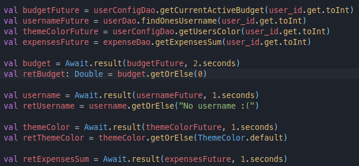

Pozwoliło to nam na utrzymanie czystości kodu, gdyż nie musieliśmy robić callback-hell, jak to często jest np w JavaScripcie.

Jednak, gdy chcieliśmy uzyskać kategorie oraz podkategorie w naszej aplikacji niemożliwym było uzyskanie takiego efektu, gdyż liczba zapytań jest zależna od ilości kategorii.

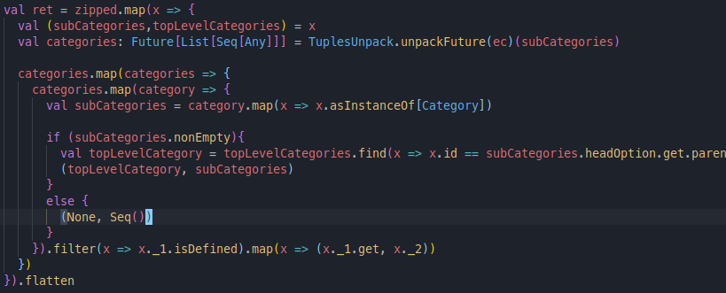

Problemem w tym miejscu był brak obsługi wielu `ResultSet` z jednego zapytania.
Taki kod nie jest ani czytelny, ani ładny, w dodatku podczas pisania tego kodu zauważyliśmy duży problem z Future w Scali. Aby spiąć wiele Future ze sobą jedyną metodą jest `.zip`, która przyjmuje pojedyńczy Future, zatem schematycznie nasze zapytanie tutaj wygląda tak:

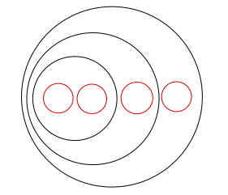

`Pojedyńcze zapytania na schemacie to czerwone kółka, dodatkowe Future opakowujące to czarne kółka`

Na pewno dużym problemem tutaj jest możliwość obserwowania takiej serii zapytań, gdyż każde 'kółko' na schemacie to kolejna Future'a, która zostaje oddelegowana do wątku o którym nie mamy pojęcia. Potencjalnie wątków przypisanych do czekania na tą operację będzie (2n-1), gdzie n to liczba zapytań.

Oczywiście Slick oraz FRM mają dużo problemów, które ciężko rozwiązać w prosty sposób. Jednak pomimo problemów napotkanych jest to dobre odejście w odróżnieniu od np Hibernate'a przez niemutowalność obiektów, brak myślenia o tym czy transakcja jest otwarta podczas zmieniania obiektów czy myślenia o PreparedStatement, kiedy chcemy użyć funkcji.

Kody 'problematyczne' zostały zostawione w projekcie w celach dydaktycznych.
